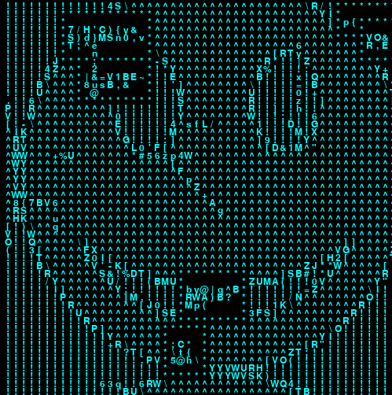

## perturbation.py



perturbation.py uses pygame to simulate a terminal which can be subjected to various corrupting effects.

### Getting started

While there are always four required parameters, there are three ways to initialize a PerturbationMatrix.

```python
from perturbation import PerturbationMatrix

# Don't forget to initialize pygame!
pygame.init()

# The surface where the matrix will be drawn
screen = pygame.display.set_mode(800, 800)

# The font which characters will use
font = pygame.font.Font(None, 18)

# The distance between characters
x_offset = 8
y_offset = 10

# The dimensions of the PerturbationMatrix
dim = 100, 100

# The color of the text
# If no color is specified, it defaults to (0, 255, 255)
text_color = (100, 200, 150)

# Load an image converted to ASCII art
# Dimension is determined automatically for images
pm = PerturbationMatrix(screen, font, x_offset, y_offset, img_path="path/to/image.png", text_color=text_color)

# Load an arbitrary string value
pm = PerturbationMatrix(screen, font, x_offset, y_offset, string_value="This will appear\nat the bottom of the matrix", dim=dim, text_color=text_color)

# Create a blank matrix
# This is the recommended way to initialize
pm = PerturbationMatrix(screen, font, x_offset, y_offset, dim=dim, text_color=text_color)
```

A PerturbationMatrix must be updated in order to process changes.

```python
pm.update()
```

Place it on the screen with `draw(x, y)`

### Perturbation

Perturbation requires two arguments, a `magnitude`, which determines the maximum length of the perturbation, and `chance`, which determines whether an individual PerturbationText is perturbed.

```python
pm.perturb(10, 0) # Each character has a 100% chance of being perturbed for up to 10 frames

pm.perturb(100, 9)  # Each character has a 1/10 chance of being perturbed for up to 100 frames
```

### Events

Currently there are two supported event types: `SCROLL` and `BROADCAST`. They can be quickly (randomly) generated:

```python
pm.add_broadcastevent()

pm.add_scrollevent()
```

A BroadcastEvent displays a text box in a static location for a limited time.

```python
from perturbation import BroadcastEvent

text = "The text to be displayed\nin the BroadcastEvent"

# The location within the PerturbationMatrix where the broadcast is displayed
column = 1
row = 1

# The number of frames the broadcast is displayed
time = 50

# The optional function to be executed after the event completes
def after_broadcast():
    print("BroadcastEvent complete")

be = BroadcastEvent(text, column, row, time, after=after_broadcast)

# Events must be added to the PerturbationMatrix
pm.add_event(be)
```

A ScrollEvent creates a line of text which travels in one of the cardinal or ordinal directions.

```python
from perturbation import ScrollEvent

# The text to be scrolled
text = "ASDFGHJKL"

# V means vertical, H means horizontal, VH means both
# + and - determine down/up or right/left
modes = ["+V", "-V", "+H", "-H", "+VH", "-VH"]

# The scroll mode determines the direction the text travels
mode = random.choice(modes)

# The starting position of the ScrollEvent
column = -1
row = -1

# The optional function to be executed after the event
def after_scroll():
    print("ScrollEvent complete.")

# The associated PerturbationMatrix is the first argument,
# as its dimensions contribute to ScrollEvent logic
se = ScrollEvent(pm, text, mode, column, row, after=after_scroll)
```

### Additional modifications

#### Translation

A PerturbationMatrix can have the entire matrix (randomly) translated in any of the four cardinal directions.

```python
pm.translate()
```

#### Pulses

A pulse is a localized perturbation. Currently there are three pulse methods, as well as one which chooses a pulse at random.

```python
pm.box_pulse()
pm.diamond_pulse()
pm.circle_pulse()
pm.random_pulse()
```

#### Rotation

If the dimensions of the PerturbationMatrix are the same, then it can be rotated.

```python
pm.rotate()  # Rotates clockwise
pm.rotate(clockwise=False)  # Rotates anticlockwise
```

#### Adding lines

To simulate a terminal, lines may be inserted to the bottom of the PerturbationMatrix.

```python
pm.feed_line("These lines will be added\nto the bottom of the matrix\nand push the existing contents upwards")

pm += "You can also add lines", "like this"

pm += None  # Adds an empty line
```

#### Clearing various properties

```python
pm.clear_events()  # Get rid of all existing events

pm.clear_perturbations()  # Get rid of all existing perturbations

pm.empty()  # Clear all text
```
